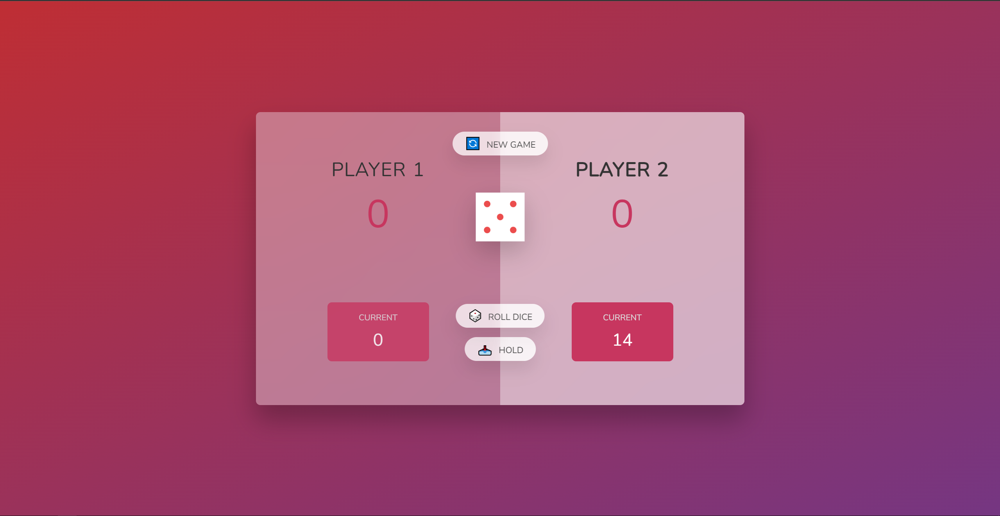

# Pig Game

Pig Game is a simple dice game played with a standard six-sided die. The goal of the game is to reach 100 points before your opponent by rolling the dice and managing the results effectively.

## About the Project

This project is part of the "The Complete JavaScript Course 2024: From Zero to Expert!" course created by Jonas Schmedtmann. The purpose of this project is to demonstrate the use of basic JavaScript concepts for user interaction and data manipulation. Some key features of the project include:

- Rolling the dice to accumulate points
- Holding current points to add to the total score
- Switching turns between players
- Displaying the winner when the game ends

The first player to reach 100 points wins the game.

## How to Run the Project

1. Download or clone this repository to your computer.
2. Open the `index.html` file in your web browser.

## Live Demo

Check out the live demo of the project on Netlify: [Pig Game Demo](https://pig-game-trpimir.netlify.app/).

## Author

This project is part of the "The Complete JavaScript Course 2024: From Zero to Expert!" course created by Jonas Schmedtmann.

## License

This project is available under the MIT license. For more information, see the `LICENSE` file.
